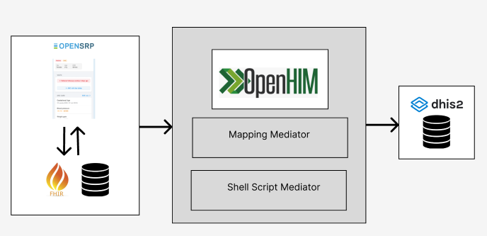

# OpenHIM-Integration

## FHIR-DHIS2 Mapping
This project provides a comprehensive mapping between FHIR (Fast Healthcare Interoperability Resources) and DHIS2 (District Health Information System 2), enabling seamless data exchange between these two widely used healthcare platforms. The mapping encompasses the conversion of various FHIR resources into human-readable intermediate formats and the transformation of FHIR bundles into a format compatible with the DHIS2 REST API.

### Solution

* Mapping mediator: Responsible for mapping FHIR data to DHIS2
* Shell script mediator: Executes an script to query FHIR data, send FHIR data to mapping mediator and send mapped data to DHIS2

### Key Features
* Comprehensive FHIR-DHIS2 mapping for data interoperability
* Conversion of FHIR resources into human-readable intermediate formats
* Transformation of FHIR bundles into DHIS2 REST API-compatible format
* Data transformation 
* Data validation

### Usage
* Utilize the mapping to convert FHIR resources into human-readable intermediate formats for easier interpretation and analysis.
* Employ the transformation functionality to convert FHIR bundles into a format compatible with the DHIS2 REST API, enabling data submission to DHIS2.
* Leverage the mapping to establish seamless data exchange between FHIR and DHIS2, fostering interoperability and data utilization.

## How to run the solution
* Run following command
`docker-compose -f docker-compose.mongo.yml up -d`
* Once the mongo containers are up get inside to the container.
`docker exec -it mapper-mongo-1 mongo`
* Run following command
`docker-compose -f docker-compose.openhim.yml up -d`
* Then add the following command.
`config = {
  "_id": "mapper-mongo-set",
  "members": [
    {
      "_id": 0,
      "priority": 1,
      "host": "mapper-mongo-1:27017"
    },
    {
      "_id": 1,
      "priority": 0.5,
      "host": "mapper-mongo-2:27017"
    },
    {
      "_id": 2,
      "priority": 0.5,
      "host": "mapper-mongo-3:27017"
    }
  ]
}

rs.initiate(config)`
* Exit the shell and run following command.
`docker run -e OPENHIM_REGISTER=false -e MONGO_URL=mongodb://mapper-mongo-1:27017,mapper-mongo-2:27017,mapper-mongo-3:27017/mapping-mediator?replicaSet=mapper-mongo-set --network mapper-cluster-network --name mapper -p 3003:3003 -d jembi/openhim-mediator-mapping:latest`
* Post the mappers to {url}:5001/endpoints
* Post the FHIR data to {url}:5001/defined-url
* Visit https://jembi.github.io/openhim-mediator-mapping/docs/gettingStarted/quick-start for more information.